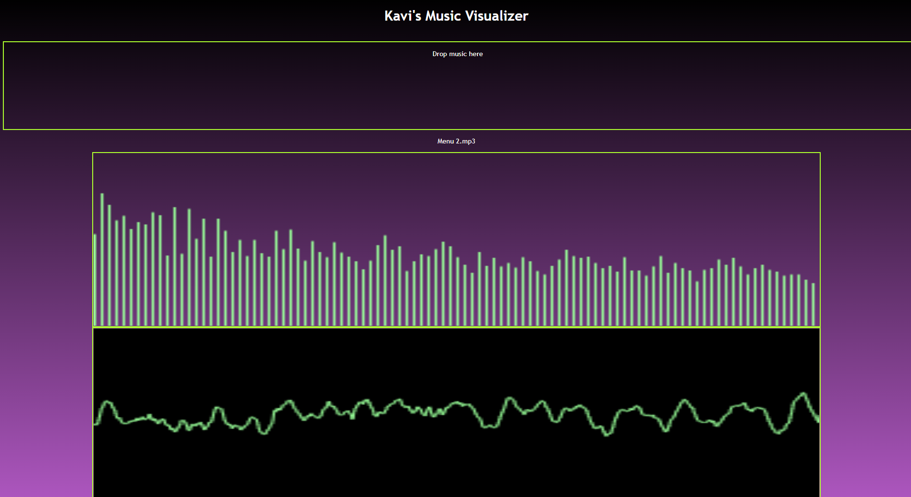

# Javascript Visualizer
This was a project I did in 2020 to refresh myself on basic javascript and learn some more about the existing Web Audio API. I wanted to replicate music visualizations that I used to see via Windows Media Player and VLC Media Player, and added some of my own features such as a drag and drop file function. There's a lot more I could work on moving forward, such as:

- Cleaning up the UI or giving it a theme. 
- Handle multiple files being dragged in with a queue
- Adding different types of visualizers.
- Removing any miscellaneous comments for the final product. I left them in my repository as a learning tool and to understand specific terms.

*Note* I have not been able to test this properly with file types past .mp3 files.

## Resources
Handling file drops: https://developer.mozilla.org/en-US/docs/Web/API/HTML\_Drag\_and\_Drop\_API/File\_drag\_and\_drop

Audio Visualizer tutorial: https://www.kkhaydarov.com/audio-visualizer/

Early HTML5 Visualizer tutorial: http://www.developphp.com/video/JavaScript/Analyser-Bars-Animation-HTML-Audio-API-Tutorial

Audio Player Drag+Drop: https://stackoverflow.com/questions/17944496/html5-audio-player-drag-and-drop

Audio Buffer: https://developer.mozilla.org/en-US/docs/Web/API/AudioBuffer